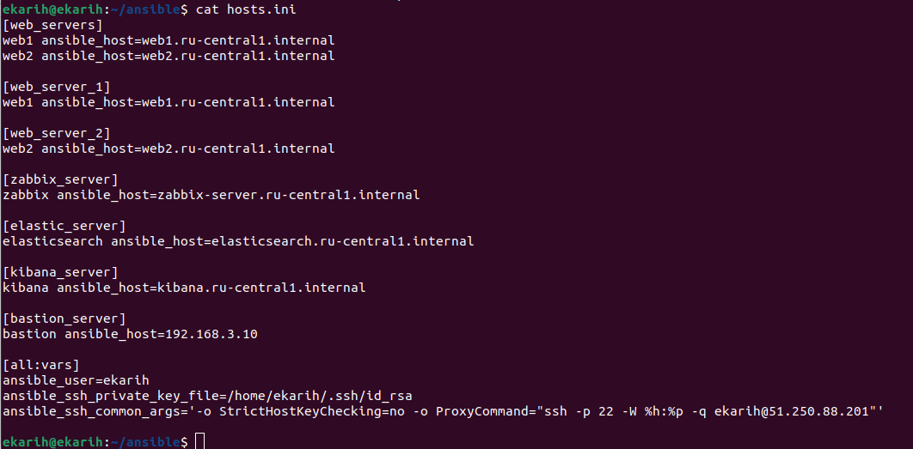
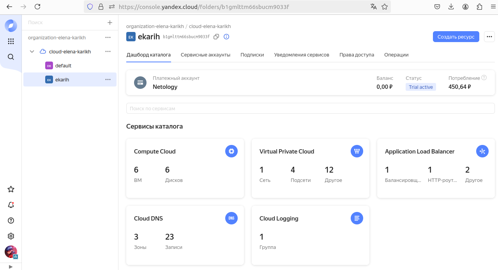

#### Дипломная работа по профессии «Системный администратор»  SYS-27

## Ключевая задача — разработать отказоустойчивую инфраструктуру для сайта, включающую мониторинг, сбор логов и резервное копирование основных данных. Инфраструктура должна размещаться в Yandex Cloud и отвечать минимальным стандартам безопасности: запрещается выкладывать токен от облака в git.

## Задание: создать инфраструктуру: 2 web-сервера, сервер для мониторинга (zabbix) настроить Dashboard, сервера для сбора и обработки логов (ELK), реализовать концепцию "bastion-host". Используемые инструменты - сервисы yandex-cloud, terraform, ansible

## Студент Карих Елена

Структурная схема создаваемой инфраструктуры:

Развертывание инфраструктуры производится посредством terraform, token, cloud_id, folder_id закрываю переменными. Генерирую пару ключей, прописываю публичный в файл meta.yml
Проверяю правильность конфигурации командой terraform plan, смотрю на отсутствие ошибок и  что все верно по конфигурации  и запускаю процесс поднятия инфраструктуры командой terraform apply, в конце выполнения получаю данные в консоль output получение которые  прописывала и сформированный файл hosts.ini в папке ansible.

Манифест терраформа: [main.tf](terraform/main.tf)

Проверяю доступность серверов ansible all -m ping

Проверяю созданные сервисы yandex-cloud:

Созданы необходимые виртуальные машины:

Создана сеть vps и четыре подсети:

Созданы security groups:

Создан балансировщик нагрузки приложений (alblb):

Созданы снимки дисков витруальных машин:

После пропингования хостов запускаю playbook.yml ansible и разворачиваю  инфраструктуры:

Плейбук ansible: [playbook.yml](ansible/playbook.yml)
Роли ansible: 
[main.yml](ansible/roles/elasticsearch/tasks/main.yml) - установка и настройка Elasticsearch
[main.yml](ansible/roles/filebeat/tasks/main.yml) - установка и настройка Filebeat
[main.yml](ansible/roles/kibana/tasks/main.yml) - установка и настройка Kibana
[main.yml](ansible/roles/nginx/tasks/main.yml) - установка и настройка Web1 Nginx
[main.yml](ansible/roles/nginx2/tasks/main.yml) - установка и настройка Web2 Nginx
[main.yml](ansible/roles/zabbix-agent/tasks/main.yml) - установка и настройка Zabbix-agent на все ВМ
[main.yml](ansible/roles/zabbix-server/tasks/main.yml) - установка и настройка Zabbix-server

Проверяю доступность web-servers nginx и настраиваю host, dashboard zabbix-server:

Интерфейс kibana:

